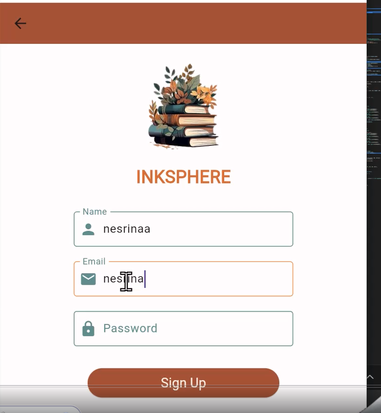

# Projet Flutter et Express.js "InkSphere 📚"
## Backend : Express.js 
``` npm i```
``` nodemon server.js```

## Frontend : Flutter
``` flutter pub get ```
``` flutter run ```

## 📺 Video
https://youtu.be/ZeQDkF9ouOs?si=uqNCF5V61_iJXQDt
## Interface du Projet

## Sign IN


